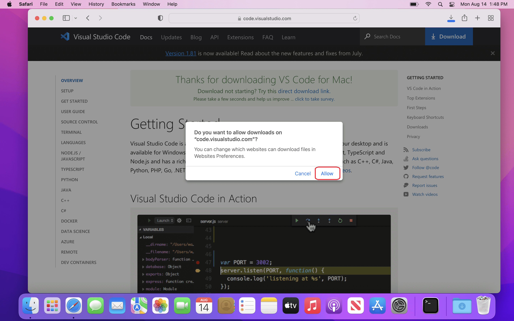
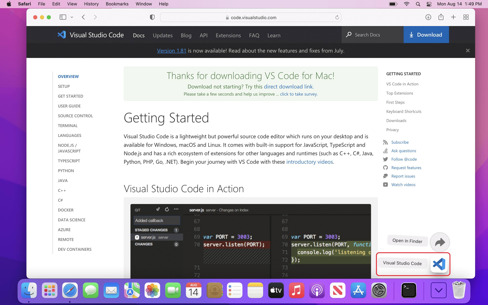
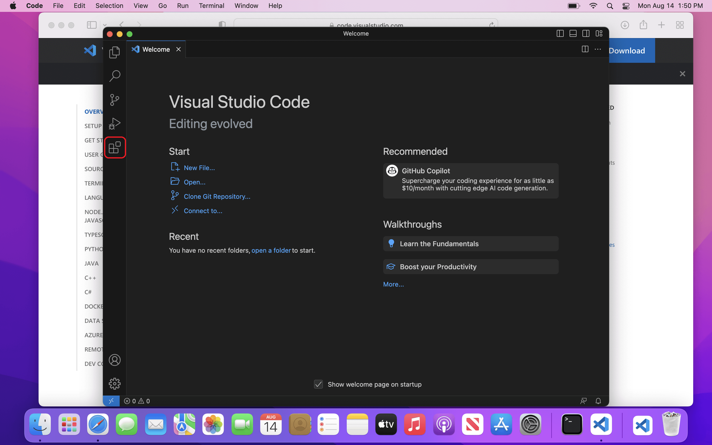
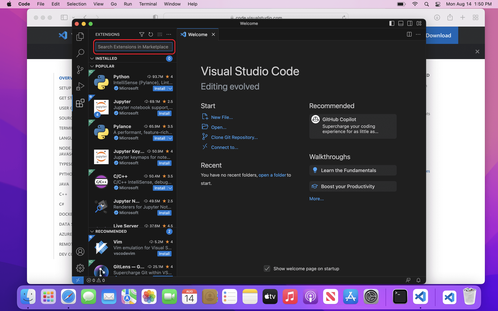
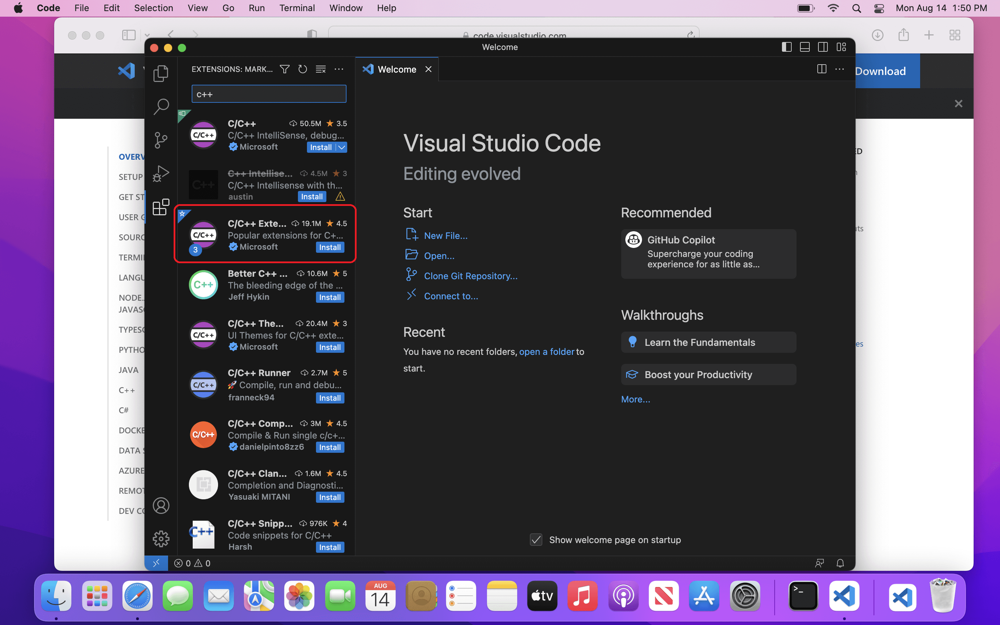

# Text Editor
Any text editor, like Notepad, TextEdit, Notepad++, etc., can be used to write C/C++ code for the microcontroller. However, this book uses [VSCode](https://code.visualstudio.com/) (Visual Studio Code), which has a great deal of extra functionalities that makes writing the code easier. These functionalities include syntax highlighting, suggestions, Auto-Complete, and many more. It also interfaces with CMake so that the code can be compiled into a binary with a single click. Following are the steps to setting up VSCode properly.

## Windows/Linux
- Download the installer for VSCode from [https://code.visualstudio.com/download](https://code.visualstudio.com/download) for your operating system and run it.
- Follow the steps shown below. Make sure to tick 'Open with VSCode'
    ````{tab-set}
    ```{tab-item} 1
    
    ```
    ```{tab-item} 2
    
    ```
    ```{tab-item} 3
    
    ```
    ```{tab-item} 4
    
    ```
    ```{tab-item} 5
    
    ```
    ```{tab-item} 6
    
    ```
    ```{tab-item} 7
    
    ```
    ```{tab-item} 8
    
    ```
    ```{tab-item} 9
    
    ```
    ```{tab-item} 10
    
    ```
    ````
- Install `WSL' extensions.
    ````{tab-set}
    ```{tab-item} 1
    
    ```
    ```{tab-item} 2
    
    ```
    ```{tab-item} 3
    
    ```
    ```{tab-item} 4
    
    ```
    ```{tab-item} 5
    
    ```
    ````
- Install 'C/C++ Extension Pack' in WSL.
    ````{tab-set}
    ```{tab-item} 1
    
    ```
    ```{tab-item} 2
    
    ```
    ```{tab-item} 3
    
    ```
    ```{tab-item} 4
    
    ```
    ```{tab-item} 5
    
    ```
    ```{tab-item} 6
    
    ```
    ```{tab-item} 7
    
    ```
    ```{tab-item} 8
    
    ```
    ```{tab-item} 9
    
    ```
    ````

## MacOS
- Download the installer for VSCode from [https://code.visualstudio.com/download](https://code.visualstudio.com/download) and install it.
    ````{tab-set}
    ```{tab-item} 1
    
    ```
    ```{tab-item} 2
    
    ```
    ```{tab-item} 3
    
    ```
    ```{tab-item} 4
    
    ```
    ```{tab-item} 5
    
    ```
    ```{tab-item} 6
    
    ```
    ````
- Install 'C/C++ Extension Pack' in WSL.
    ````{tab-set}
    ```{tab-item} 1
    
    ```
    ```{tab-item} 2
    
    ```
    ```{tab-item} 3
    
    ```
    ```{tab-item} 4
    
    ```
    ```{tab-item} 5
    
    ```
    ````